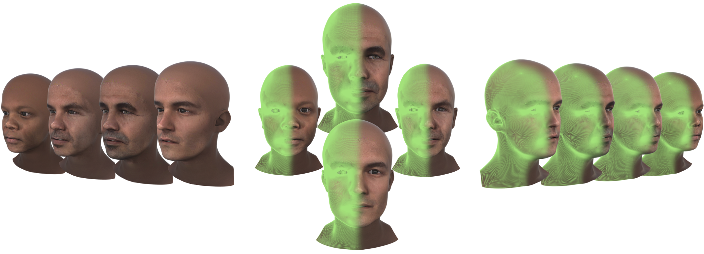
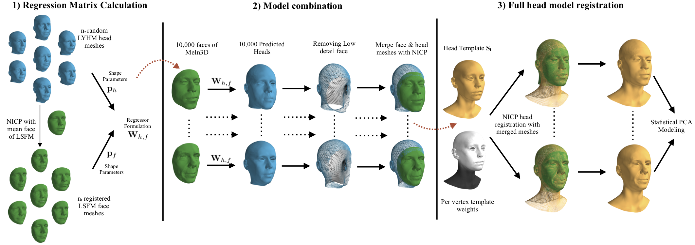
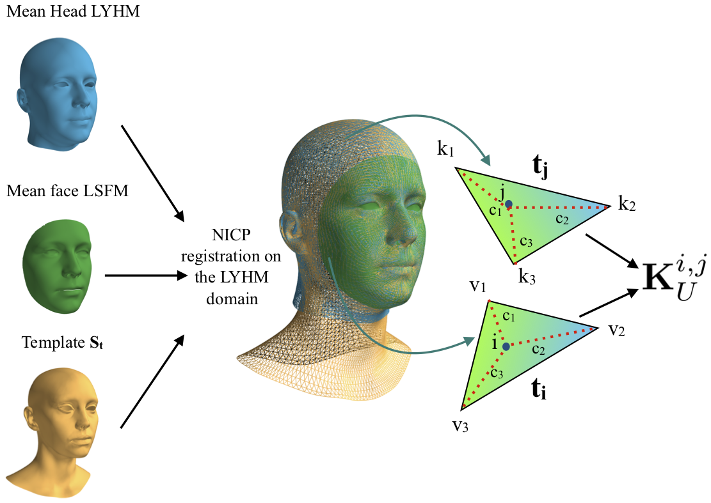
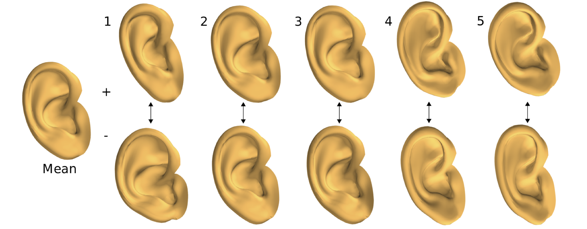
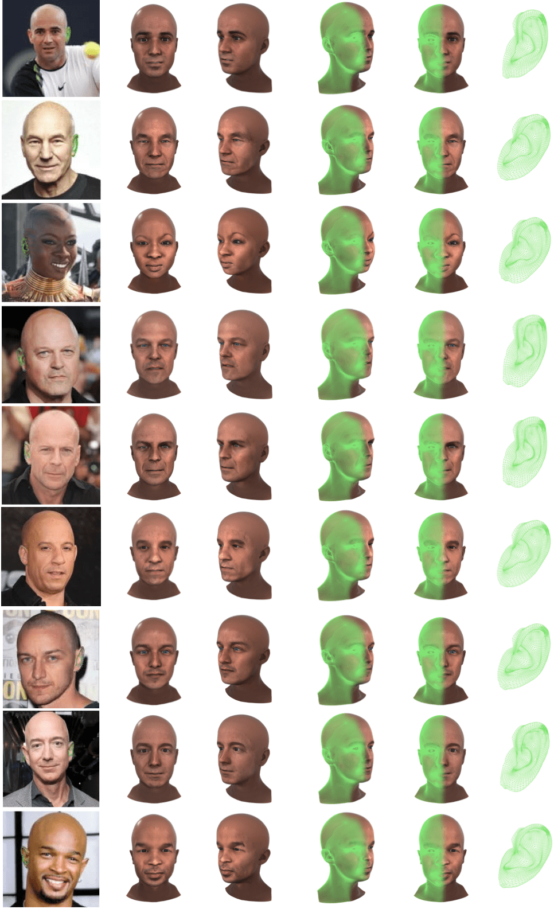
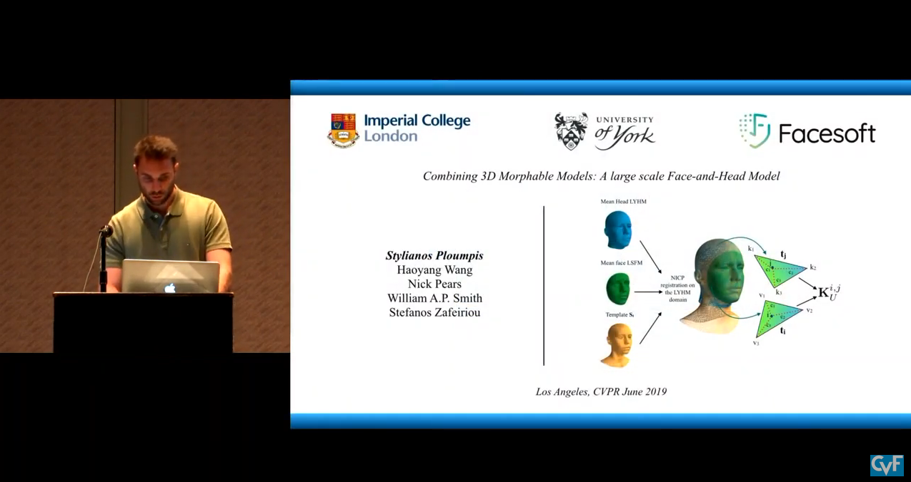

# [Towards a complete 3D morphable model of the human head](https://arxiv.org/abs/1911.08008)

 [Stylianos Ploumpis](https://www.imperial.ac.uk/people/s.ploumpis)<sup> 1,2</sup>, [Evangelos Ververas](https://ibug.doc.ic.ac.uk/people/eververas)<sup> 1,2</sup>, [Eimear O'Sullivan](https://ibug.doc.ic.ac.uk/people/eo'sullivan)<sup> 1,2</sup>, [Stylianos Moschoglou](https://ibug.doc.ic.ac.uk/people/smoschoglou)<sup> 1,2</sup>, [Haoyang Wang](https://ibug.doc.ic.ac.uk/people/hwang)<sup> 1</sup>, [Nick Pears](https://www-users.cs.york.ac.uk/~nep/)<sup> 3</sup>, [William A. P. Smith](https://www.cs.york.ac.uk/cvpr/member/will/)<sup> 3</sup>, [Baris Gecer](https://ibug.doc.ic.ac.uk/people/bgecer)<sup> 1,2</sup>, & [Stefanos Zafeiriou](https://wp.doc.ic.ac.uk/szafeiri/)<sup> 1,2</sup>
 <br/>
 <sup>1 </sup>Imperial College London, UK
 <br/>
 <sup>2 </sup>FaceSoft.io
 <br/>
 <sup>3 </sup>University of York, UK
#### [CVPR2019] Extension Submited to [PAMI]

<br/>

<p align="center"></p>

<br/>

## Abstract

Three-dimensional Morphable Models (3DMMs) are powerful statistical tools for representing the 3D shapes and textures of an object class. Here we present the most complete 3DMM of the human head to date that includes face, cranium, ears, eyes, teeth and tongue. To achieve this, we propose two methods for combining existing 3DMMs of different overlapping head parts: i.~use a regressor to complete missing parts of one model using the other, ii.~use the Gaussian Process framework to blend covariance matrices from multiple models. Thus we build a new combined face-and-head shape model that blends the variability and facial detail of an existing face model (the LSFM) with the full head modelling capability of an existing head model (the LYHM). Then we construct and fuse a highly-detailed ear model to extend the variation of the ear shape. Eye and eye region models are incorporated into the head model, along with basic models of the teeth, tongue and inner mouth cavity. The new model achieves state-of-the-art performance. We use our model to reconstruct full head representations from single, unconstrained images allowing us to parameterize craniofacial shape and texture, along with the ear shape, eye gaze and eye color.

## Approach

<p align="center"></p>
Detailed overview of our regression modeling pipeline. 1) The left part illustrates the matrix formulation from the original LYHM head model; 2) the central part demonstrates how we utilize the MeIn3D database to produce highly-detailed head shapes; 3) the final part on the right depicts the registration framework along with the per-vertex template weights and the statistical modeling.

<p align="center"></p>
A graphical representation of the non-rigid registration of all mean meshes along with our head template St and the calculation of the local covariance matrix Ki,j based on the locations of the ith and jth points.


<br/>

## Embeded Ear and Eye 3DMM

<p align="center"></p>

<p align="center"></p>

<br/>


## Head Reconstruction Results from single images

<p align="center"></p>

<br/>

## Citation
If you find this work is useful for your research, please cite our [papers](http://openaccess.thecvf.com/content_CVPR_2019/html/Ploumpis_Combining_3D_Morphable_Models_A_Large_Scale_Face-And-Head_Model_CVPR_2019_paper.html):

```
@inproceedings{ploumpis2019combining,
  title={Combining 3D Morphable Models: A Large scale Face-and-Head Model},
  author={Ploumpis, Stylianos and Wang, Haoyang and Pears, Nick and Smith, William AP and Zafeiriou, Stefanos},
  booktitle={Proceedings of the IEEE Conference on Computer Vision and Pattern Recognition},
  pages={10934--10943},
  year={2019}
}

@article{ploumpis2019towards,
  title={Towards a complete 3D morphable model of the human head},
  author={Ploumpis, Stylianos and Ververas, Evangelos and Sullivan, Eimear O' and Moschoglou, Stylianos and Wang, Haoyang and Pears, Nick   and Smith, William AP and Gecer, Baris and Zafeiriou, Stefanos},
  journal={arXiv preprint arXiv:1911.08008},
  year={2019}
}

```

<br/>

## Public release models
The head models have been freely available for research and education purposes. To obtain access to the models, you need to complete and sign the user agreement form (can be found in this repository, user_agreement.pdf). This agreement should be completed by a full-time academic staff member (not a student) or a craniofacial clinician. The form should be signed, and emailed to Stylianos Ploumpis (s.ploumpis@imperial.ac.uk), Nick Pears (nick.pears@york.ac.uk). We will verify your request and contact you on how to download the model package. Note that the agreement requires that:

1. The models are used for non-commercial research and education purposes only.
2. You agree not copy, sell, trade, or exploit the model for any commercial purposes.
3. In any published research using the models, you cite the following papers:

Combining 3D Morphable Models: A Large scale Face-and-Head Model, Stylianos Ploumpis, Haoyang Wang, Nick Pears, William AP Smith, Stefanos Zafeiriou, Proceedings of the IEEE Conference on Computer Vision and Pattern Recognition, 2019

Towards a complete 3D morphable model of the human head, S.Ploumpis, E.Ververas, E.Sullivan, S.Moschoglou, H.Wang, N.Peers, W.Smith andvS.Zafeiriou, arXiv preprint 			arXiv:1911.08008


### Oral CVPR 19 presentation
<a href="http://www.youtube.com/watch?feature=player_embedded&v=fNlMGWm7bbk&t=4700s
" target="_blank"></a>
